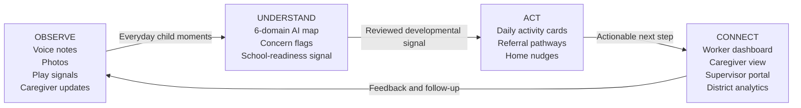
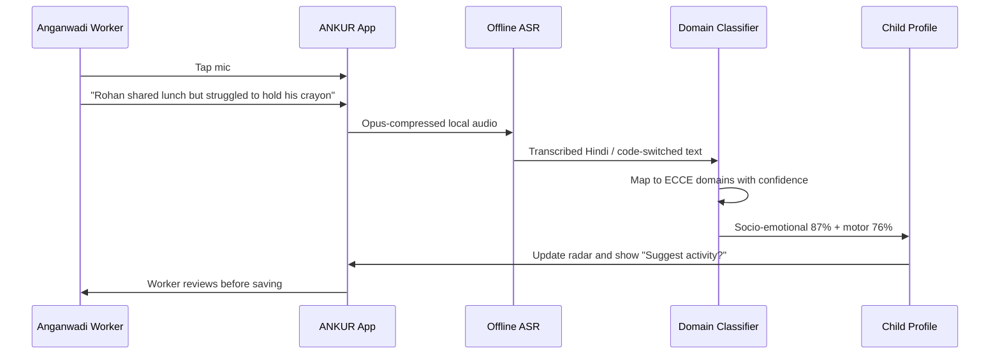
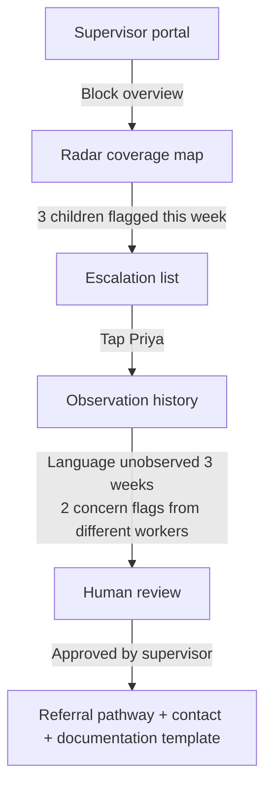
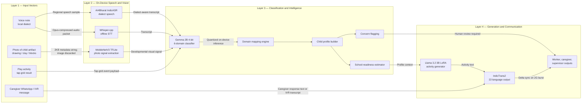
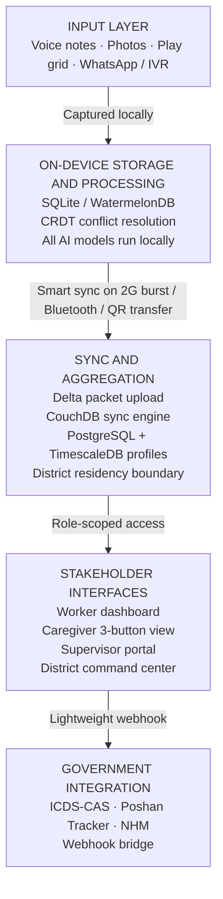
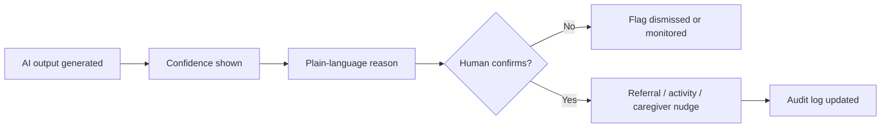
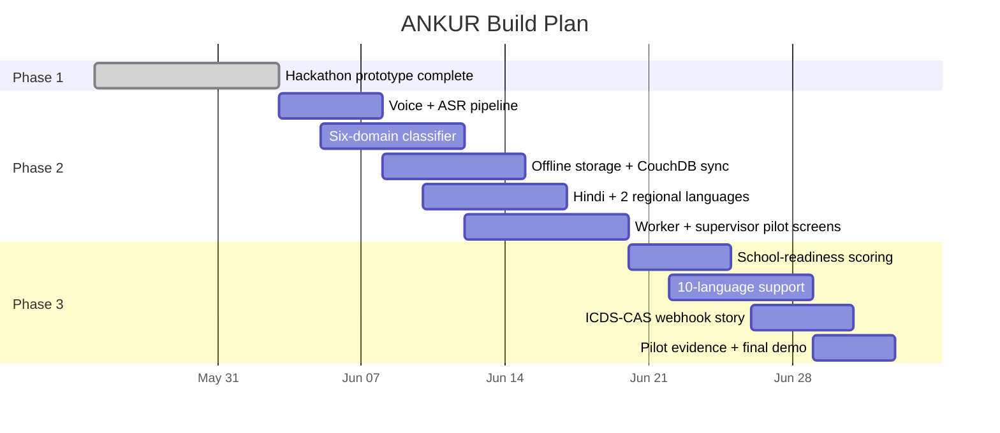

# ANKUR — अंकुर

> Every child deserves to be seen before they fall behind.

**Offline-first AI-powered developmental intelligence for India's Anganwadi and ICDS ecosystem.**

ANKUR is a React + Vite hackathon prototype for a public-interest child development tracking platform. It helps Anganwadi workers capture everyday observations through voice, photo, and play flows, converts those moments into six-domain developmental signals, recommends practical activities, and connects caregivers, supervisors, and district teams through role-specific views.

<p align="center">
  
</p>

<p align="center">
  
  
  
  
</p>

---

## The Problem

India's early childhood system records attendance, weight, immunisation, and monthly reports. Those registers are necessary, but they do not answer the question that matters most:

> Is this child developing on track across language, motor, cognitive, socio-emotional, cultural, and learning-habit domains?

| Current system measures | What actually matters |
| --- | --- |
| Attendance register filled | Is this child's language developing on track? |
| Weight recorded monthly | Is this child forming healthy attachments? |
| Vaccination status updated | Is this child becoming school-ready? |
| Monthly report submitted | Did anyone notice this child is falling behind? |

### Pitch Evidence Frame

| Signal | Why it matters |
| --- | --- |
| **14 lakh** Anganwadi centres | The solution must work at national scale, not only in polished pilots. |
| **8 crore** children under age 6 in ICDS | Small workflow improvements can become population-level developmental visibility. |
| **6 months** average delay from concern to formal identification | Earlier pattern recognition is the core impact lever. |
| **5+ registers** per worker per month | Documentation burden is already high; ANKUR must reduce cognitive load. |
| **70% referral drop-off** | A flag without a follow-up pathway is not enough. |
| **₹0 real-time developmental tools** | Frontline workers need usable feedback, not another reporting layer. |

---

## Product Loop

ANKUR turns developmental tracking into a byproduct of care.



**Core design principle:** the worker should not spend time categorising observations. The AI does that in the background; the worker stays with the child.

---

## Who ANKUR Is Built For

| User | Need | ANKUR response |
| --- | --- | --- |
| **Anganwadi Worker** | Spot gaps across 25+ children without more paperwork | Voice-first capture, daily focus list, AI-tagged domains |
| **Caregiver / Parent** | Understand progress and support the child at home | Local-language WhatsApp or IVR nudges |
| **Supervisor / CDPO** | See emerging concerns before paper data arrives late | Block radar, escalation queue, referral templates |
| **District Administrator** | Allocate resources using live developmental trends | Aggregate analytics and risk clusters |
| **State ECCE Team** | Build policy from outcome feedback | Longitudinal, privacy-preserving development signals |
| **The Child** | Be noticed early enough for support to matter | A living developmental profile across six domains |

### Context Conditions

| Constraint | Design answer |
| --- | --- |
| Intermittent or no internet | Offline-first local storage and delayed sync |
| Entry-level Android phones | Lightweight UI and proposed quantized models |
| 22+ Indian languages | Indic language pipeline and voice-first flows |
| Low digital literacy | Large tap targets, one task per screen, icon-first navigation |
| Under 15 minutes for documentation | Observation capture embedded into daily care |

---

## Key User Workflows

### 1. Worker Records a Voice Observation



### 2. Caregiver Receives a Home Nudge

```mermaid
flowchart LR
    A["Worker approves activity"] -->|"Personalisation request"| B["Activity generator"]
    B -->|"Family language selected"| C["IndicTrans2 output"]
    C -->|"WhatsApp / IVR"| D["Caregiver receives nudge"]
    D -->|"Done / voice reply"| E["Observation logged"]
    E -->|"Delta sync when available"| F["Child profile updated"]
```



Example caregiver message:

> Rohan is building number sense. Have him count five potatoes with you while you cook.

### 3. Supervisor Reviews Escalation



---

## Why AI Is Necessary

Without AI, ANKUR becomes another form. With AI, it becomes a developmental intelligence layer that reads the moments workers already see.

| Task | Without AI | With ANKUR AI |
| --- | --- | --- |
| Categorising observations | Worker manually assigns domains, usually inconsistently | Auto-mapped to six ECCE domains with confidence |
| Spotting patterns | Concerns wait for paper review | Flags surface from repeated signals |
| Multilingual documentation | Workers default to Hindi or skip details | Voice-first support for local languages and code-switching |
| Activity recommendations | Generic activity lists | Child-specific recommendation for today's gap |
| Caregiver engagement | Paper slip sent home | Voice or WhatsApp message in family's language |
| School-readiness estimation | Annual subjective snapshot | Continuous score updated from observations |

---

## AI Methodology

The production architecture is designed as an offline-first pipeline with open-source models and no cloud inference dependency.



| Model | Why this model | Target RAM | Offline |
| --- | --- | --- | --- |
| Gemma 2B 4-bit | Open, small, suitable for six-class classification | `<2GB` | Yes |
| Whisper.cpp | CPU-only speech transcription | `<1GB` | Yes |
| IndicTrans2 | Indian-language translation layer | `<2GB` | Yes |
| AI4Bharat IndicASR | Indian dialect ASR direction | `<1GB` | Yes |
| MobileNetV3 TFLite | Lightweight on-device vision | Minimal | Yes |
| Llama 3.2 3B LoRA | Fine-tuned activity generation direction | `<3GB` | Yes |

**Target incremental AI licensing cost:** ₹0 across the proposed open-source model stack.

---

## Evaluation Plan

| Task | Metric | Target |
| --- | --- | --- |
| Speech transcription | Word Error Rate | `<15%` on regional dialect pilots |
| Domain classification | Macro F1 | `>0.82` across all six domains |
| Concern detection | Recall | High recall, human-confirmed |
| Activity recommendation | Worker usefulness rating | `>4/5` in field pilot |
| Caregiver message relevance | Engagement response rate | Measured in pilot |
| School-readiness estimation | Correlation with ASER-style indicators | Validated in Phase 2 |

### Data and Fine-Tuning Inputs

| Source | Use |
| --- | --- |
| NCERT ECCE framework documentation | Milestone and domain grounding |
| ASER-style benchmark references | Readiness validation direction |
| Synthesised Anganwadi-style observations | Early model prototyping |
| Co-designed examples from AWWs | Field realism and phrasing |
| Multilingual and code-switched samples | Hindi/regional robustness |
| Domain-labeled signal library | Specialist-reviewed classifier labels |

---

## System Architecture

Local device is the source of truth. The cloud is a sync target, not a dependency.



### Connectivity Tier Stack

| Tier | Mode | What still works |
| --- | --- | --- |
| Tier 1 | 4G / WiFi | Full AI features and real-time sync |
| Tier 2 | 2G burst | Background delta sync; full offline function continues |
| Tier 3 | WhatsApp only | Caregiver bridge without app install |
| Tier 4 | Bluetooth mesh | Worker-to-worker peer sync |
| Tier 5 | USSD `*987#` | Feature phone fallback |

---

## Responsible AI and Equity

Equity is not a feature in ANKUR. It is the constraint that shaped every decision.

| Commitment | Product decision |
| --- | --- |
| Human-in-the-loop escalation | Every concern flag requires worker or supervisor confirmation |
| No diagnostic language | The product speaks in observations, concerns, and support pathways |
| Confidence visibility | Every AI output displays uncertainty |
| Explainability | Each concern flag explains why it was raised in plain language |
| Photo privacy | Images are processed locally and discarded; only signal metadata syncs |
| Data minimisation | Sync deltas carry only what the next role needs |
| District data residency | Child data remains within the responsible administrative boundary |
| Differential privacy | Aggregate analytics avoid exposing individual children |
| Federated learning direction | Models improve without raw child data crossing districts |
| Low-literacy UX | Voice-first, icon-first, one task per screen |



---

## Prototype Features in This Repository

| Area | Implemented in the current React prototype |
| --- | --- |
| Role selection | Worker, caregiver, supervisor, district pathways |
| Worker home | Priority children, offline status, quick observation actions |
| Voice flow | Simulated Hindi observation, AI tags, activity recommendation |
| Photo flow | Simulated on-device analysis and no-upload privacy note |
| Play flow | Group activity completion updates child profiles |
| Child profile | Six-domain radar chart, concern flag, readiness progress |
| Recommendation | Personalized center activity and home nudge toggle |
| Caregiver view | Bilingual family-facing progress and activity screen |
| Supervisor dashboard | Escalation and coverage narrative |
| District analytics | Aggregate risk and planning signals |
| Accessibility | Skip link, focus states, language toggle, contrast controls |

---

## Implementation Plan



### Phase 2 Scope Boundary

| In scope | Future scope |
| --- | --- |
| Voice and photo observation capture | Full Bluetooth mesh implementation |
| Six-domain AI classification | USSD production pipeline |
| Child profiles and radar maps | Predictive school-readiness model |
| Activity recommendations | National federated learning rollout |
| Caregiver WhatsApp nudges | District command center analytics |
| Supervisor portal | Full government MIS integration |

### Risks and Mitigations

| Risk | Mitigation |
| --- | --- |
| Low digital-literacy adoption | Voice-first UX, icon-heavy screens, embedded micro-training |
| Poor connectivity | Offline-first storage, QR and Bluetooth fallback design |
| Dialect accuracy gaps | AI4Bharat ASR direction and co-designed field examples |
| Worker resistance | Build around burden reduction, not additional reporting |
| Data governance concerns | No photo upload, consent flow, audit logs, district residency |

---

## Two-Person Team Fit

ANKUR is scoped for focused execution by two people.

| Role | Responsibilities |
| --- | --- |
| **AI / ML + Backend** | Speech AI pipeline, NLP classification, offline sync, FastAPI direction, model evaluation |
| **Product + Frontend** | ECCE framing, low-literacy UX, React prototype, user research, pilot planning |

> A two-person team building for scale requires ruthless prioritisation. Phase 2 is designed around what two people can build, test, and validate in three weeks.

---

## Tech Stack

| Layer | Current prototype | Production direction |
| --- | --- | --- |
| Frontend | React 19 + Vite 8 | React Native / PWA |
| Styling | CSS with Baloo 2 + Noto Sans direction | Accessible design system |
| Local state | React state | SQLite / WatermelonDB |
| AI | Simulated in prototype | On-device open-source model stack |
| Sync | Narrative prototype | CouchDB delta sync + CRDT conflict handling |
| Analytics | UI prototype | PostgreSQL + TimescaleDB |

---

## Getting Started

### Prerequisites

- Node.js 20 or newer
- npm

### Install

```bash
npm install
```

### Run locally

```bash
npm run dev
```

Open the Vite URL shown in your terminal, usually:

```text
http://localhost:5173
```

### Build

```bash
npm run build
```

### Preview production build

```bash
npm run preview
```

### Lint

```bash
npm run lint
```

---

## Repository Structure

```text
ankur/
|-- public/
|   |-- favicon.svg
|   `-- icons.svg
|-- src/
|   |-- assets/
|   |   |-- hero.png
|   |   |-- react.svg
|   |   `-- vite.svg
|   |-- App.jsx
|   |-- App.css
|   |-- index.css
|   `-- main.jsx
|-- index.html
|-- package.json
|-- vite.config.js
`-- README.md
```

---

## SDG Alignment

| SDG | Alignment |
| --- | --- |
| SDG 3 — Good Health and Well-Being | Early identification and support pathways |
| SDG 4 — Quality Education | School-readiness and ECCE development |
| SDG 5 — Gender Equality | Supports a frontline workforce largely made of women |
| SDG 10 — Reduced Inequalities | Designed for language, device, literacy, and connectivity constraints |
| SDG 17 — Partnerships | Built to integrate with government systems, not replace them |

---

## Status

ANKUR is currently a hackathon prototype. This repository demonstrates the product experience, role-specific workflows, pitch narrative, and frontend interaction model. The production AI pipeline, sync engine, and government integrations are architecture targets for the next build phase.

---

## License

See [LICENSE](./LICENSE) for usage terms.
